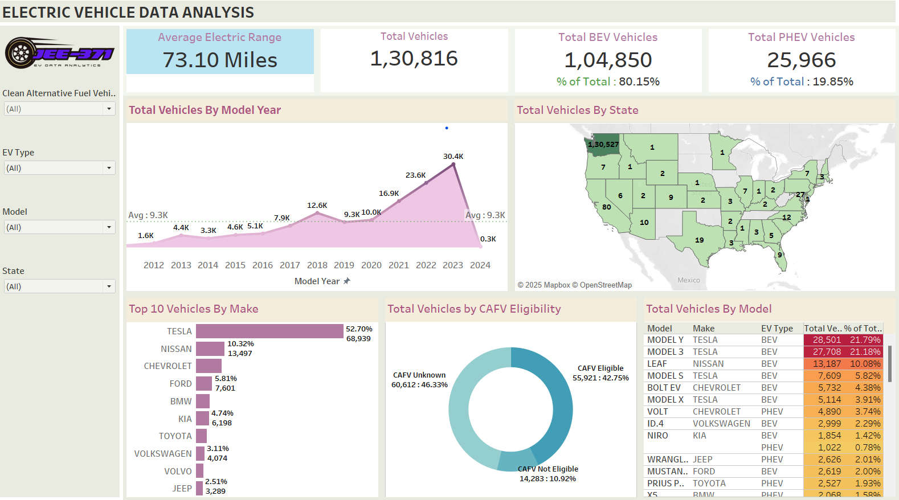

# 🚗 Tableau EV Analysis Dashboard

This project presents a Tableau dashboard designed to analyze Electric Vehicle (EV) data in the United States. The dashboard provides insights into EV adoption patterns, vehicle types, manufacturer trends, and model-level distributions.

---
## 🗂️ Dataset Source

This dashboard is based on the **Electric Vehicle Population Data** from Kaggle:

🔗 [Electric Vehicle Population Data on Kaggle](https://www.kaggle.com/datasets/ratikkakkar/electric-vehicle-population-data)

---
## 📊 Dashboard Overview

The dashboard includes the following interactive sheets:

1. **Total BEV Vehicles**  
2. **Total PHEV Vehicles**  
3. **Average Electric Range**  
4. **Total Vehicles by Model Year**  
5. **Total Vehicles by State**  
6. **Total Vehicles by Make**  
7. **Total Vehicles by CAFV Eligibility**  
8. **Total Vehicles by Model**

### 🔍 Filters Used

The dashboard provides interactivity using the following filters:

- **Clean Alternative Fuel Vehicle (CAFV) Eligibility**
- **EV Type** (BEV or PHEV)
- **Model**
- **State**
- **Make**

---

## 🧾 Dataset Fields

The dataset used in this dashboard contains various fields grouped into:

### ➤ Dimensions
- `City`, `County`, `State`, `Postal Code`
- `Make`, `Model`, `Model Year`, `EV Type`
- `Vehicle Location`, `Clean Alternative Fuel Vehicle Eligibility`, `Electric Utility`
- `VIN (1-10)`, `2020 Census Tract`, `Legislative District`

### ➤ Measures
- `% of BEV Vehicles`, `% of PHEV Vehicles`
- `Total BEV Vehicles`, `Total PHEV Vehicles`, `Total Vehicles`
- `Electric Range`, `Average Electric Range`
- `Base MSRP`, `Electric_Vehicle_Population`
- `Latitude (generated)`, `Longitude (generated)`

## 📊 Dashboard


---
## 📂 Repository Structure
```
Tableau-EV-Dashboard/                      # Root directory of the project
├── sheets/                                # Visual assets for documentation
│   ├── Total Vehicles By Model Year.png   # The number of electric vehicles categorized by their model year to analyze adoption trends over time.
│   └── Total Vehicles By State.png        # The state-wise distribution of electric vehicles to identify regional patterns in EV adoption.
│   └── Top 10 Vehicles By Make            # Most popular EV manufacturers based on the number of registered vehicles.
│   └── Total Vehicles By CAFV Eligibility # Count of vehicles eligible for Clean Alternative Fuel Vehicle (CAFV) incentives, reflecting policy impact.
│   └── Total Vehicles By Model            # Total EV population by specific vehicle models to assess market penetration at the model level.
│
├── dashboard/                             # Tableau workbook files
│   └── EV_Dashboard.png                   # Presentation Image of the tableau dashboard
│   └── EV Data Analysis.twb               # Packaged Tableau workbook
│
├── README.md                              # Project documentation and usage guide
├── .gitignore                             # Files and folders to be ignored by Git
└── LICENSE                                # License information for the repository
```
